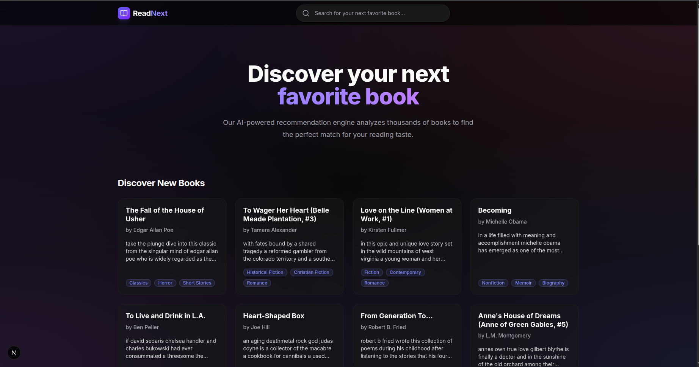
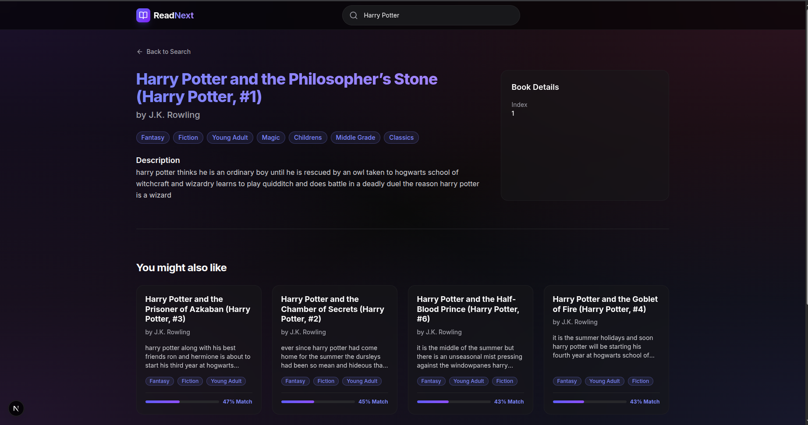
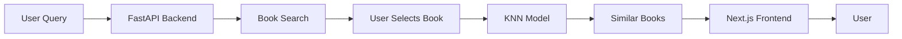

<div align="center">

# 📚 ReadNext

### *Discover Your Next Favorite Book*

An AI-powered Book Recommendation System using Content-Based Filtering to deliver personalized suggestions.

[](https://python.org)
[](https://fastapi.tiangolo.com)
[](https://nextjs.org)
[](https://typescriptlang.org)
[](https://tailwindcss.com)
[](https://docker.com)

</div>

---

## 🖼️ Screenshots

<div align="center">

| Home Page | Search Results | Book Recommendations |
|:---------:|:--------------:|:--------------------:|
| *Netflix-style dark theme with gradient accents* | *Real-time fuzzy search with instant results* | *AI-powered similar book suggestions* |

 |  | 
</div>

---

## ✨ Features

- 🤖 **AI-Powered Recommendations** — Content-based filtering using K-Nearest Neighbors (KNN) algorithm
- 🔍 **Fuzzy Search** — Find books instantly with typo-tolerant title matching
- 🎨 **Netflix-Style Dark UI** — Modern, responsive interface with smooth animations
- ⚡ **High Performance** — Async FastAPI backend with optimized ML inference
- 📖 **Rich Book Data** — Detailed metadata including genres, descriptions, and authors
- 🐳 **Containerized** — One-command deployment with Docker Compose
- 📱 **Responsive Design** — Works seamlessly on desktop and mobile devices

---

## 🚀 Getting Started

### Prerequisites

- [Docker](https://www.docker.com/get-started) (v20.10 or higher)
- [Docker Compose](https://docs.docker.com/compose/install/) (v2.0 or higher)

### Quick Start

1. **Clone the repository**
   ```bash
   git clone https://github.com/nrshousha/ReadNext.git
   cd ReadNext
   ```

2. **Start the application**
   ```bash
   docker compose up --build
   ```

3. **Access the application**
   
   | Service | URL | Description |
   |---------|-----|-------------|
   | 🌐 **Frontend** | [http://localhost:3000](http://localhost:3000) | Netflix-style UI |
   | 📡 **API Docs** | [http://localhost:8000/docs](http://localhost:8000/docs) | Swagger UI |
   | 📋 **ReDoc** | [http://localhost:8000/redoc](http://localhost:8000/redoc) | Alternative API docs |

4. **Try it out!**
   - Search for a book (e.g., "Harry Potter", "Lord of the Rings")
   - Click on any book to see AI-powered recommendations
   - Explore similar books based on content similarity

---

## 🏗️ Project Structure

```
ReadNext/
├── 📂 backend/                  # FastAPI Backend
│   ├── main.py                  # API endpoints & app config
│   ├── requirements.txt         # Python dependencies
│   └── Dockerfile
│
├── 📂 frontend/
│   └── 📂 readnext/             # Next.js Frontend (Active)
│       ├── app/                 # App Router pages
│       │   ├── page.tsx         # Home page
│       │   ├── books/[id]/      # Book detail & recommendations
│       │   └── components/      # Reusable UI components
│       ├── lib/api.ts           # API client
│       └── Dockerfile
│
├── 📂 ml/                       # Machine Learning
│   ├── 📂 data/                 # Preprocessed datasets
│   │   ├── books_metadata.pkl   # Book information
│   │   └── embeddings.pkl       # Feature vectors
│   ├── 📂 inference/
│   │   └── predictor.py         # BookRecommender class
│   └── 📂 training/
│       └── train.ipynb          # Model training notebook
│
├── docker-compose.yml           # Container orchestration
└── README.md
```

---

## 🔌 API Reference

### Search Books

```http
GET /books/search?q={query}&limit={limit}
```

| Parameter | Type | Description |
|-----------|------|-------------|
| `q` | string | **Required.** Search query (book title) |
| `limit` | int | Max results (default: 10, max: 50) |

**Example Response:**
```json
{
  "query": "harry",
  "count": 5,
  "books": [
    {
      "index": 1,
      "title": "Harry Potter and the Philosopher's Stone",
      "author": "J.K. Rowling",
      "description": "A young wizard discovers his magical heritage...",
      "genres": ["Fantasy", "Fiction", "Young Adult"]
    }
  ]
}
```

### Get Recommendations

```http
POST /recommend
```

| Body Parameter | Type | Description |
|----------------|------|-------------|
| `book_index` | int | **Required.** Index of the source book |
| `top_k` | int | Number of recommendations (default: 5, max: 20) |

**Example Response:**
```json
{
  "source_book": { ... },
  "recommendations": [
    {
      "index": 42,
      "title": "The Name of the Wind",
      "author": "Patrick Rothfuss",
      "similarity_score": 0.8542,
      ...
    }
  ]
}
```

---

## 🧠 How It Works



1. **Data Preprocessing** — Book descriptions are vectorized using TF-IDF
2. **Feature Engineering** — Numeric features (ratings, pages) are normalized
3. **Model Training** — K-Nearest Neighbors finds similar books in feature space
4. **Real-time Inference** — Pre-computed embeddings enable fast recommendations

---

## 🛠️ Tech Stack

| Layer | Technology | Purpose |
|-------|------------|---------|
| **ML** | Scikit-Learn, Pandas | KNN model, data processing |
| **Backend** | FastAPI, Uvicorn | REST API, async server |
| **Frontend** | Next.js 16, React 19 | Server & client rendering |
| **Styling** | Tailwind CSS 4 | Utility-first CSS |
| **Icons** | Lucide React | Modern icon library |
| **DevOps** | Docker, Docker Compose | Containerization |

---

## 📄 License

This project is licensed under the MIT License - see the [LICENSE](LICENSE) file for details.

---

<div align="center">

**Built with ❤️ for book lovers everywhere**

*ReadNext — Because every book deserves a sequel in your reading list*

</div>
